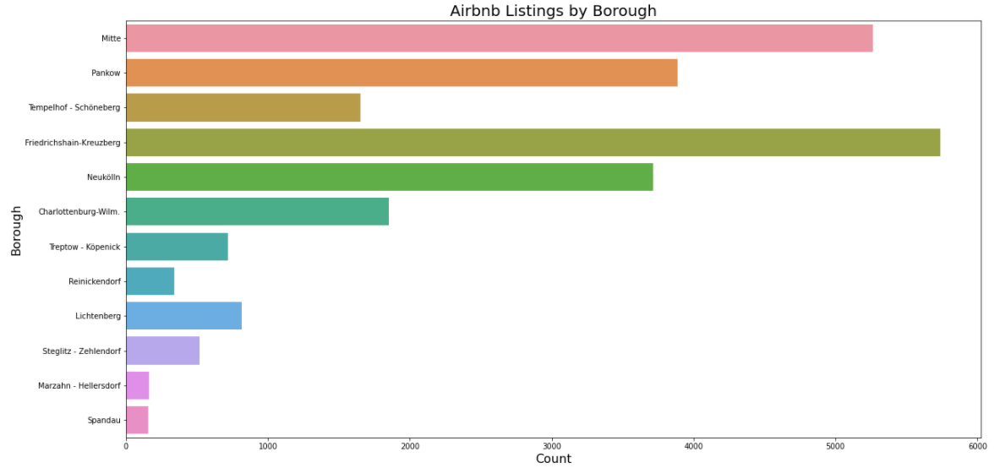

# AlexCerce_Portfolio
This page provides an overview of past and ongoing personal data projects. Each project was started due to a personal
interest in the topic or to build an interesting tool which can help boost my future projects. My favroite part of the
data process is being able to build a result which will have a noticeable impact. In the following projects, I attempt
to answer questions which can be seen through collected and analyzed data.

## [Credit Card Fraud Prediction](https://github.com/alexcerce/CreditCardFraud)
I've always been interested in anomaly detection models which can help detect the occurance of rare events.
This project tackles one area where anomaly detection is widely used in order to reduce fraud with the help
of machine learning. I started this as a continuation of research done by the machine learning group at ULB.
The goal of this was project was to try many different models, sampling techniques, feature elimination methods,
and performance metrics in order to build a good model.

This project includes:
* Developed a model to predict credit card fraud on a large imbalanced dataset.
* Experimented with multiple different models and data sampling techniques.
* Built an XGBoost model with SMOTE oversampling to obtain 90% recall and 88% precision.
  
  

  
  
  

## [Investigating the Rise of Airbnb in Berlin \[In Progress\]](https://github.com/alexcerce/Berlin_Airbnb)
  In the summer of 2018 I spent the summer studying in Berlin and learning about past and current issues.
  One of the largest modern issues in Berlin, is the rise of Airbnb. Many expats moving to Berlin struggle
  to find apartments, a large part of this issue has been due to the rise of Airbnb. Many apartment owners have realized
  how much more money they can make off Airbnb in comparison to the cheaper long-term rental prices.
  To investigate this, I am utilizing data scrapped directly from airbnb as part of the [Inside Airbnb Project](http://insideairbnb.com/get-the-data.html).
  With this data, I have built visualizations and prediction models to better understand key factors
  in the rise of Airbnb.
  
  This project includes:
  * Collecting data from multiple tables
  * Extensive cleaning
  * Building visualizations to better understand the situation
  * Developing a basic pricing model to give new Airbnb users the optimal listing price for their apartment
  
  
  
  
  
  ## [Automating the Data Analysis Process](https://github.com/alexcerce/Berlin_Airbnb)
  
  * Automating common tasks for any project, which includes loading data, importing required libraries, 
    basic data cleaning operations, and basic data analysis tasks.
  * Utilizing functions and classes to specify how each process will perform
